  

  
  

## About Me

I'm a Computer Science student at Cruzeiro do Sul University (São Paulo, Brazil), building a solid foundation in software engineering and applying it to systems that integrate AI with real software.

I started programming with **Python**. **Java** and **C** then came in parallel as part of my Computer Science degree. Today, **Java** is the core language of my software engineering development — object-oriented design, software design and backend foundations. **Python** complements that base for automation, AI integration and LLM-based applications, while **C** contributes to my programming fundamentals and low-level concepts, such as memory and how code relates to the system underneath it.

At first, I was mainly learning languages and building programs. Over time — through Computer Science and the projects I've built — the way I think about software changed. I started paying attention to how components are organised, how responsibilities are separated and why different technologies play different roles in the same system: how APIs connect systems, how external services are integrated, how automation interacts with real software, how LLMs can be one part of a larger system, how agents can interact with tools, and how architecture affects performance, reliability and scalability.

That shift shows in what I've built: a **voice-driven AI assistant** in Python (Whisper, an LLM, text-to-speech and OS-level automation), a **browser automation system** with Playwright and LLM integration that runs real workflows on a live e-commerce platform, and Java prototypes exploring layered design and AI agents.

It also defines where I'm heading: **backend engineering and system architecture**, **AI systems**, and — progressively — **AI Infrastructure Engineering**, the layer that makes AI applications run reliably and efficiently, with C++ as part of my path into systems programming.

`Python` → `Java + C` → `Software Engineering` → `Backend & System Architecture` → `Automation & AI Systems` → `AI Infrastructure`

## Current Focus

- **Backend engineering** — deepening my understanding of backend architecture, REST APIs and how services integrate with each other.
- **AI systems & LLM applications** — building software where LLMs are part of a larger system, not just a prompt.
- **Software design** — interfaces as contracts, composition, dependency direction and low coupling in Java.
- **Systems & performance** — memory, concurrency, the relationship between CPU, cache, RAM, storage and network, and their impact on latency.
- **C/C++ and systems programming** — expanding from C fundamentals into C++.
- **AI Infrastructure Engineering** — exploring how AI systems run at scale: serving, latency, caching and efficient use of compute. I've studied, at design level, a semantic-similarity cache for LLM responses (lookup flow, similarity thresholds, memory and metrics).

## Technical Skills

**Software Engineering** 
Building with Java and object-oriented programming — abstraction, encapsulation, composition, polymorphism and interfaces. Continuously developing my software design around separation of responsibilities and low coupling, supported by data structures and algorithms.

**Backend Development** 
Developing experience in Java and Python for backend work, REST APIs and integration between system components. Deepening my understanding of backend architecture and service communication.

**AI & LLM Systems** 
Building LLM-powered applications: LLM integration, AI-powered workflows, voice pipelines (speech-to-text → LLM → text-to-speech) and prompt engineering. Developing experience in AI agent design and in connecting models to real software.

**Automation** 
Working with Python automation and Playwright: browser automation, persistent browser contexts, workflow automation, UI flow mapping and application state handling.

**Databases & Data** 
Working with SQL and PostgreSQL — relational databases, data modelling, queries and CRUD operations.

**Systems & Infrastructure** 
Deepening my understanding of operating systems concepts, computer networks, system architecture, concurrency, memory management and performance. Exploring the infrastructure side of AI systems.

## Languages

| Language | Where it fits in my work |
| :-- | :-- |
| **Java** | Core of my software engineering and backend foundation — OOP, software design and Java-based AI prototypes. |
| **Python** | My practical language for automation, Playwright, LLM integration and the voice assistant. |
| **C** | Programming foundations — data structures, memory and system-level concepts. |
| **C++** | Part of my current progression into systems programming and performance. |
| **SQL** | Relational data with PostgreSQL. |

## Selected Projects

### AI-Assisted E-commerce Automation — Shopee / WeDrop
`Python` `Playwright` `LLM`

Automation system that runs operational workflows for a Shopee store through the WeDrop platform, with an LLM integrated into the process.

- Browser automation with Playwright, using a **persistent browser context/profile** across runs.
- Mapping of UI elements and flows, with **state handling** for the different states the application can be in.
- **LLM integration** inside the automation workflow.
- Built and improved iteratively through real use — debugging and fixing issues that only surfaced when interacting with a live web application.

**What it demonstrates:** automating real-world software, state handling, debugging under real conditions, and integrating AI into an automation pipeline.

### Voice-Driven AI Assistant (Jarvis)
`Python` `Whisper` `LLM` `TTS`

A voice assistant that connects speech, AI and the operating system in a single command flow.

- **Voice pipeline:** audio capture and processing → speech recognition with **Whisper** → response generation with an **LLM** → speech synthesis (**TTS**).
- **OS interaction:** launching applications, running commands and locating files.
- **Operating modes** that group related actions, triggered by voice.
- Independent components (audio, AI, automation) integrated into one command-processing flow.

**What it demonstrates:** multi-component integration, audio and AI pipelines, and system-level automation.

### AI Learning Assistant
`Java` `OOP` `LLM`

Academic prototype of a study assistant that uses an LLM to generate personalised study recommendations.

- Organised in packages/layers — model, services and interface.
- Object-oriented domain modelling, with services and LLM integration.

**What it demonstrates:** layered application structure in Java and LLM integration inside an object-oriented design.

### AI Agents in Java
`Java` `OOP`

Hands-on studies and projects on building AI agents and AI-enabled applications in Java.

- Agent concepts modelled through classes and services.
- Focus on separation of responsibilities, class organisation and integration between components.

**What it demonstrates:** applying software engineering principles to the design of AI agents.

## Technologies & Tools

  
  
  
  
  
  
  
  
  
  

  
  
  

## Contact

Open to internship and junior opportunities in Software Engineering, Backend and AI Engineering.

- **LinkedIn:** [linkedin.com/in/reeisdu](https://www.linkedin.com/in/reeisdu)
- **Email:** [eduardoreisdasilva532@gmail.com](mailto:eduardoreisdasilva532@gmail.com)
- **Languages:** Portuguese (native) · English (advanced)
